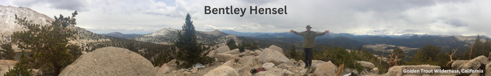

  

  

  

      
    <h1 style="display:inline">The Abouts</h1>
    

    A tech innovator at heart, my journey resembles that of a mariner in the realm of technology. Steering the digital ship through high tides and tranquil seas, I've excelled in the roles of a technical product manager, operations director, and CEO, amassing a treasure trove of achievements along the way. My love for technology does not confine itself to the professional sphere – in my 375TB homelab, I enjoy crafting innovative tools that bridge the gap between imagination and reality.  

    When not immersed in the binary world, you'll often find me exploring the natural one, whether that be sailing the open waters, backpacking through scenic trails, or running through the historic paths of Arlington, VA, my beloved home. No matter the activity, I carry with me the same spirit of adventure and discovery that fuels my professional endeavors. Be it creating purposeful projects or exploring new landscapes, every venture is a chance to make waves and leave a positive imprint.
      
    Interested in working together?
     
    <a href="https://bentleyhensel.com/lets-work-together/?utm_source=github&utm_medium=pabout_me&utm_campaign=about_me_link" target="_blank">
    BentleyHensel.com/lets-work-togther
    </a>
     
  

  

